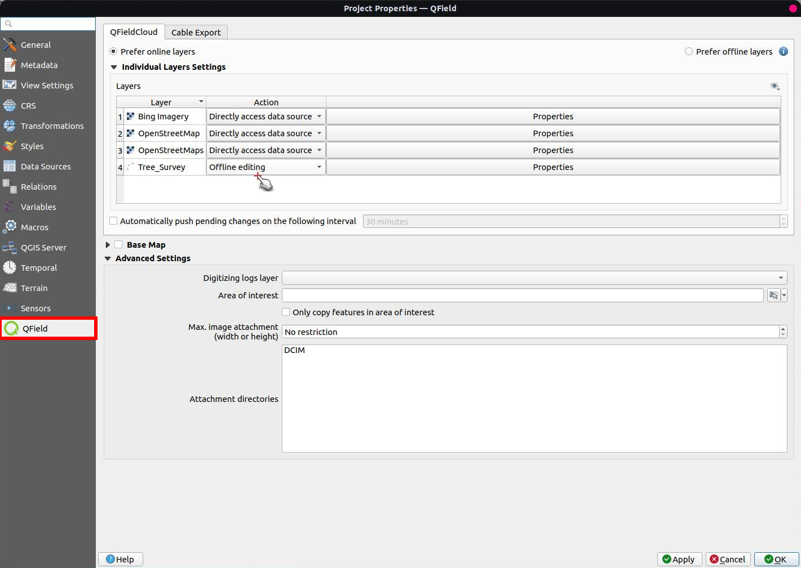
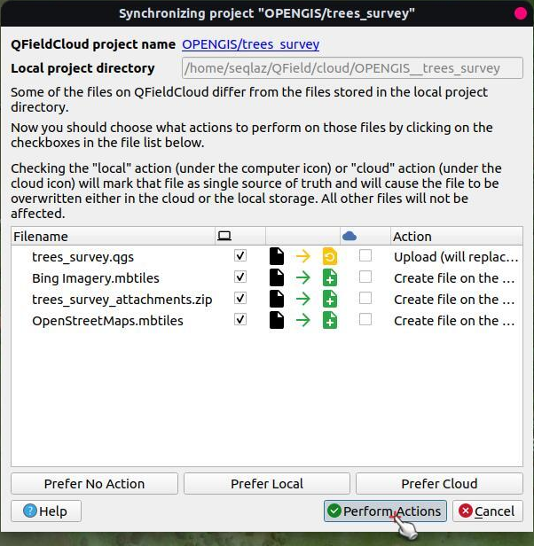
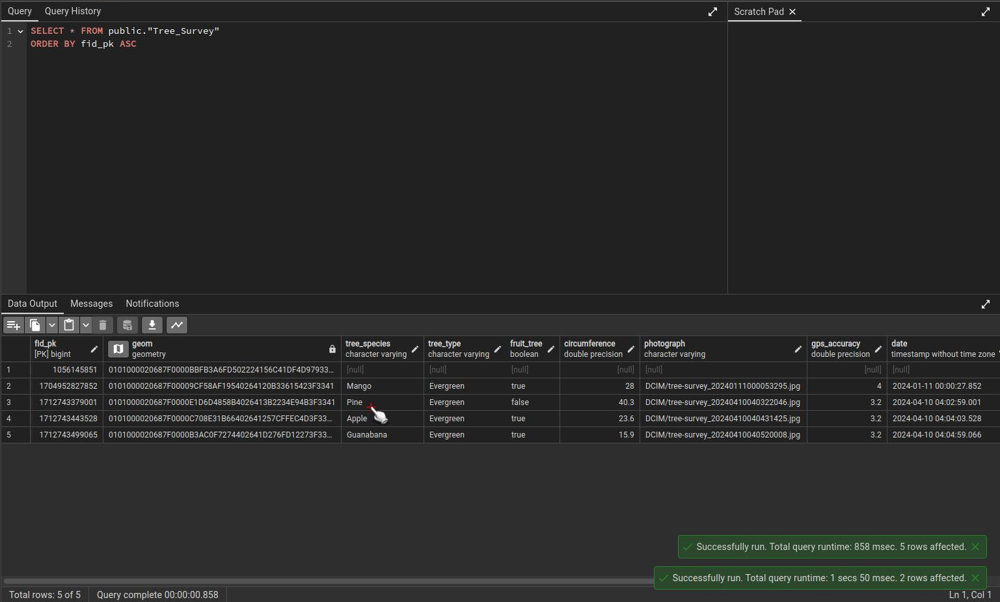
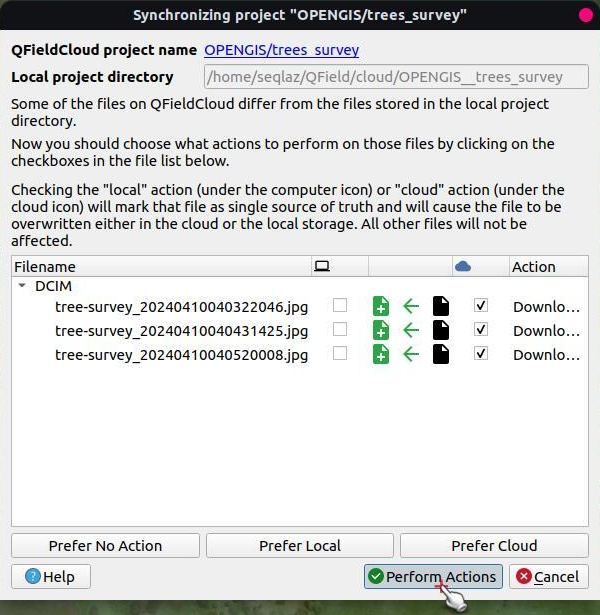
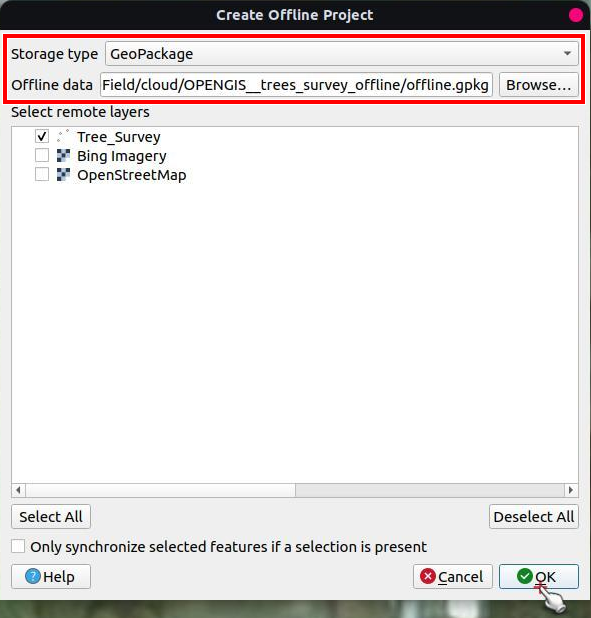
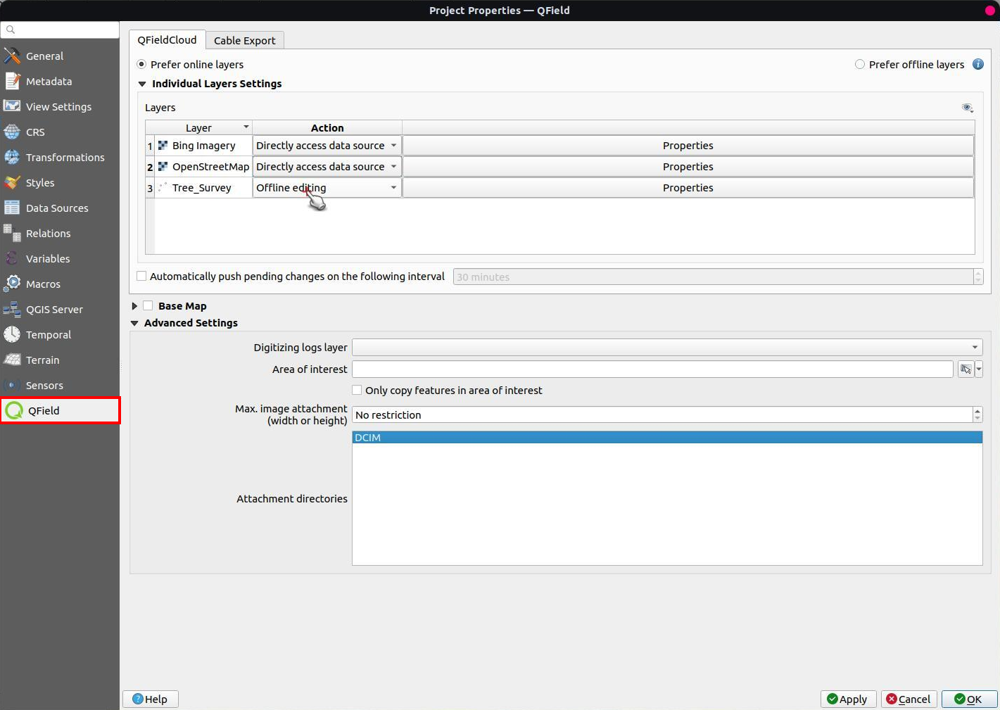
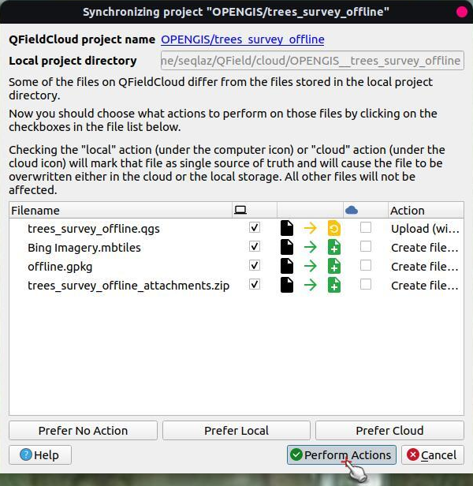
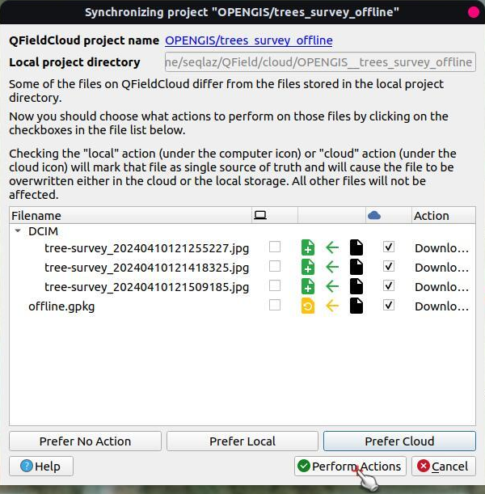
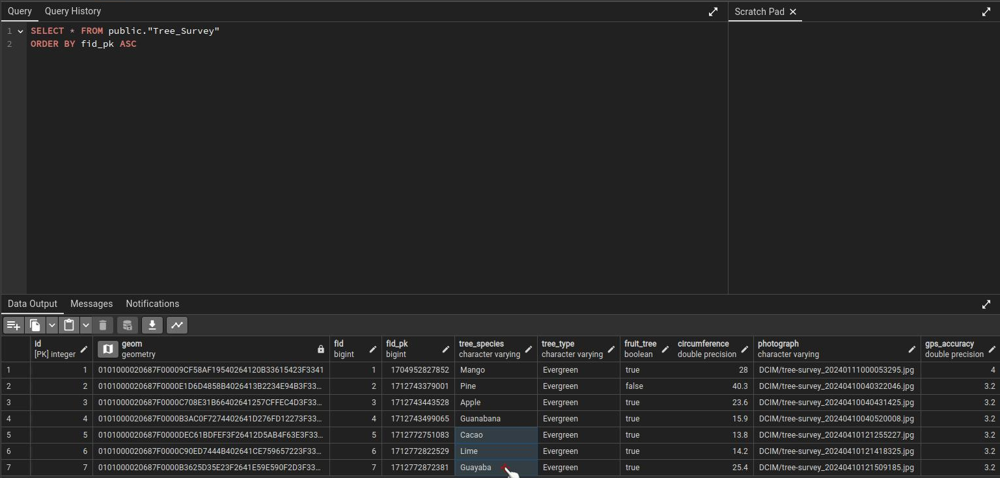

# QFieldCloud System Documentation
  The aim of this document is to provide an overview of the QFieldCloud system to
  understand the underlaying logic and technology.

## Entities and Concepts

### QGIS Project
A QGIS project is a *.qgs* or *.qgz* file. A Project is created on
QGIS Desktop and uploaded to QFieldCloud using the QGIS's plugin
QFieldSync. Before the uploading of the QGIS project, it is necessary
for each layer of the QGIS project an "action" that determines how
QFieldSync and QField should treat the layer. There are the two types
of actions that can be setup - one for QFieldCloud and one for the
traditional cable export.

This information is saved within the QGS project as layer's
*customProperty*, with the *QFieldSync/action* key.

The available actions are:

| Action internal name | Name showed in the UI |
|----------------------|-----------------------|
| OFFLINE              | Consolidate           |
| NO_ACTION            | Live layer            |
| REMOVE               | Ignore layer          |
| COPY                 | Copy                  |
| KEEP_EXISTING        | Keep Existing         |

This would be the behavior of QFieldSync with the different
layer actions:

| Action        | File based layer                                                 | Not file based layer                   |
|---------------|------------------------------------------------------------------|----------------------------------------|
| OFFLINE       | Create a consolidated copy of the data                           | Create a consolidated copy of the data |
| NO_ACTION     | N/A                                                              | No action on the layer                 |
| REMOVE        | Remove the layer from the project                                | Remove the layer from the project      |
| COPY          | Make source path relative and copy the file                      | N/A                                    |
| KEEP_EXISTING | Make source path relative and copy the file if it does not exist | N/A                                    |

 This is the behavior of QFieldCloud (`libqfieldsync`) with the
 layers:

| Action        | File based layer                                                                                                | Not file based                                                                                 |
|---------------|-----------------------------------------------------------------------------------------------------------------|------------------------------------------------------------------------------------------------|
| OFFLINE       | Create consolidated copy of the data on pull, apply delta file on push to original data source                  | Create consolidated copy of the data on pull, apply delta file on push to original data source |
| NO_ACTION     | N/A                                                                                                             | No action on the layer                                                                         |
| REMOVE        | Remove the layer from the project                                                                               | Remove the layer from the project                                                              |
| COPY          | Make source path relative and create copy of the data on pull, apply delta file on push to original data source | N/A                                                                                            |
| KEEP_EXISTING | Make source path relative and create copy of the data on pull, apply delta file on push to original data source | N/A                                                                                            |

This is the behavior of QField with the layers:

| Action        | File based layer                   | Not file based layer                       |
|---------------|------------------------------------|--------------------------------------------|
| OFFLINE       | Create and push deltafile          | N/A (it's always file based at this point) |
| NO_ACTION     | N/A                                | Edit the online (live) database            |
| REMOVE        | N/A (the layer is no longer there) | N/A (the layer is no longer there)         |
| COPY          | Create and push deltafile          | N/A                                        |
| KEEP_EXISTING | Create and push deltafile          | N/A                                        |

In summary, for with QFieldCloud:

- *NO_ACTION* is used for online layers that are located on a server
  accessible via the Internet and that are modified directly by
  QField.
- *HYBRID* means that a geopackage will be generated on the
  server (or directly on the desktop for file-based layers) and
  downloaded by clients. The client will generate deltafiles of the changes.
- *OFFLINE* is used for example to work with local databases not
  visible by QFieldCloud which are consolidated before being
  loaded from the desktop to the server and are not synchronized
  with the original data by QFieldCloud.
- *REMOVE* will simply remove the layer from the project.
- *KEEP_EXISTENT* will not be used for QFieldCloud syncronizations.

From QFieldSync it will be possible to update a project already
loaded on QFieldCloud. In the event that the changes concern only
styles, forms etc. but not the structure of the layers, the
project on the server will simply be updated.
If there are changes in the layers structure, the project will be
reset on the server (delta files will be deleted) and for each
client it will be necessary to download the updated version of the
project before being able to push new changes.

### QFieldCloud Project
    Is composed of one and only one QGIS project and the possible
    related files (e.g. geopackages, images, ...) included the offline
    or hybrid data package.

## Use Cases

### Hybrid

Hybrid editing mode with synchronization on the server

!

Hybrid Mode allows users to seamlessly transition between online and offline environments.

#### Project Creation in QFieldCloud

- Access [QFieldCloud](https:app.qfield.cloud/) and create a new project. Ensure that the project name follows the specified conventions: use underscores instead of spaces and avoid special characters. Provide all required information and specifications before finalizing the project creation by pressing the "Create" button.

!

#### Project Synchronization in QGIS

- Open QGIS and navigate to the QFieldSync plugin.
- Select "QFieldCloud Projects Overview" and choose the desired project, in this case the newly created project.
- Click "Synchronize Selected Cloud Project" to initiate project synchronization.

!

- Specify the directory for project synchronization. The default location (~/QField/cloud/project_name) is recommended.
- Proceed by clicking "Next", then "OK".
- Add layers from your PostgreSQL database, ensuring you use a connection established through a [pg_service.conf](../../how-to/pg-service.md) file.
- Configure the project settings, including styles and forms, as per your requirements.

#### Offline Editing Configuration

- Navigate to "Project Properties" in QGIS.
- Under the "QField" section and the "QFieldCloud" tab, set the action for layers to "Offline editing".

!

#### Secret Creation in QFieldCloud

- Within QFieldCloud project, create a [secret](../qfieldcloud/secrets.md) in the "Secrets" section (recommended to directly copy and paste directly from the pg_service.conf file).

#### Project Synchronization

- Return to QGIS and press "Synchronize Current Cloud Project" within QFieldSync.
- Choose "Prefer Local" and "Perform Actions".

!

#### Survey and Data Collection

- Once finished the Jobs, download and synchronize the project on devices designated for surveying.
- Start surveying, utilizing the project.
- Changes made during the survey will be stored locally on the device.

#### Data Upload to Cloud and Download the latest data

- Once back in an area with internet connectivity push the changes made during the survey to the cloud by initiating synchronization.
- Monitor the progress of synchronization jobs to ensure successful completion.
- Reviewed changes will automatically update in the PostgreSQL database.

!

- Check changes directly in QGIS. Synchronization of the attachments for download may be required to view the updates.

!

### Offline database

Offline editing mode with desktop synchronization

!

Offline Mode is designated to utilize GeoPackage to collect and consolidate the information then manually push the changes to the PostgreSQL:

#### Project Creation in QFieldCloud in Offline mode

- Access [QFieldCloud](https:app.qfield.cloud/) and create a new project. Ensure that the project name follows the specified conventions: use underscores instead of spaces and avoid special characters. Provide all required information and specifications before finalizing the project creation by pressing the "Create" button.

!

#### Project Synchronization in QGIS in Offline mode

- Open QGIS and navigate to the QFieldSync plugin.
- Select "QFieldCloud Projects Overview" and choose the desired project, this case the new created project.
- Click "Synchronize Selected Cloud Project" to initiate project synchronization.

!

- Specify the directory for project synchronization. The default location (~/QField/cloud/project_name) is recommended.
- Proceed by clicking "Next", then "OK".
- Add layers from your PostgreSQL database.
- Configure the project settings, including styles and forms as your requirements.

#### Offline Data Conversion

- Utilize the core QGIS plugin "OfflineEditing" (make sure to have it active).
- Navigate to "Database > Offline Editing" and select "Convert to Offline Project...".

!

- Choose GeoPackage as the storage type for offline data.
- Specify the offline data location within the cloud project directory. It's essential to save it in the location accessible to QFieldCloud project.
- Select the layers for offline conversion and confirm by pressing "OK".

!

#### Offline Editing Configuration in Offline mode

- Configure offline editing actions in QGIS:
  - Navigate to "Project Properties" and access the "QField" section, then the "QFieldCloud" tab.
  - Set the action for layers to "Offline editing".

!

#### Project Synchronization in Offline mode

- Then in QGIS and press "Synchronize Current Cloud Project" within QFieldSync.
- Choose "Prefer Local" and "Perform Actions".

!

#### Survey and Data Collection in Offline mode

- Download and synchronize the project on devices designated for surveying.
- Conduct surveys in project.
- Changes made during the survey will be stored locally on the device.

#### Data Synchronization and Database Update

- Upon returning to an area with internet connectivity push the changes made during the survey to the cloud by initiating synchronization.
- Monitor the progress of synchronization jobs to ensure successful completion.
- In QGIS, download the latest data and attachments of the project using QFieldSync.

!

- Navigate to "Database > Offline Editing" and select "Synchronize".

!

- This action will synchronize the locally stored changes with the PostgreSQL database.
- Reviewed changes will be updated in the PostgreSQL database, ensuring data integrity.

!
